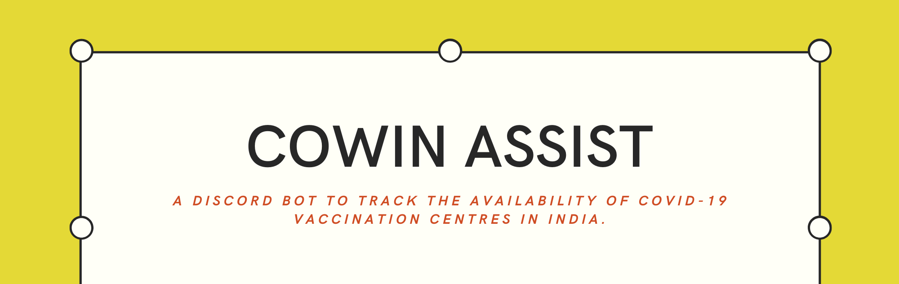
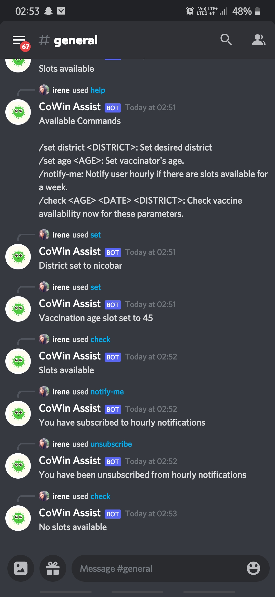
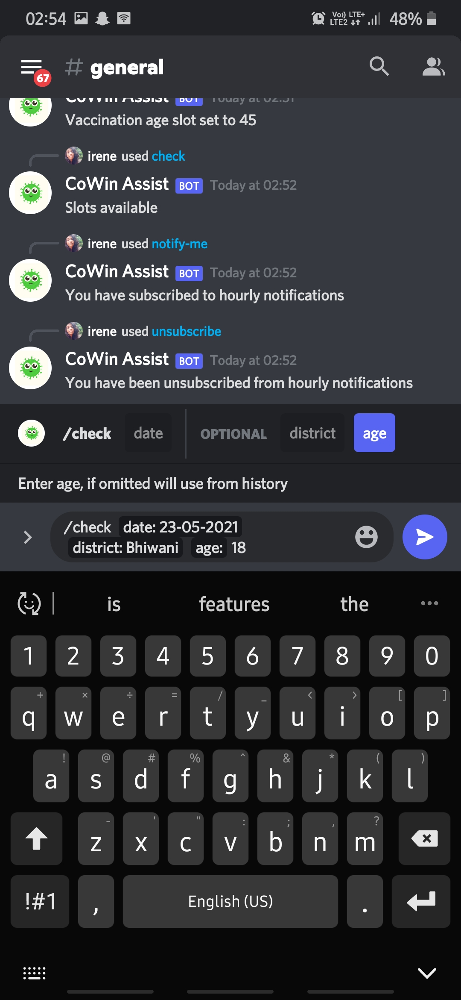
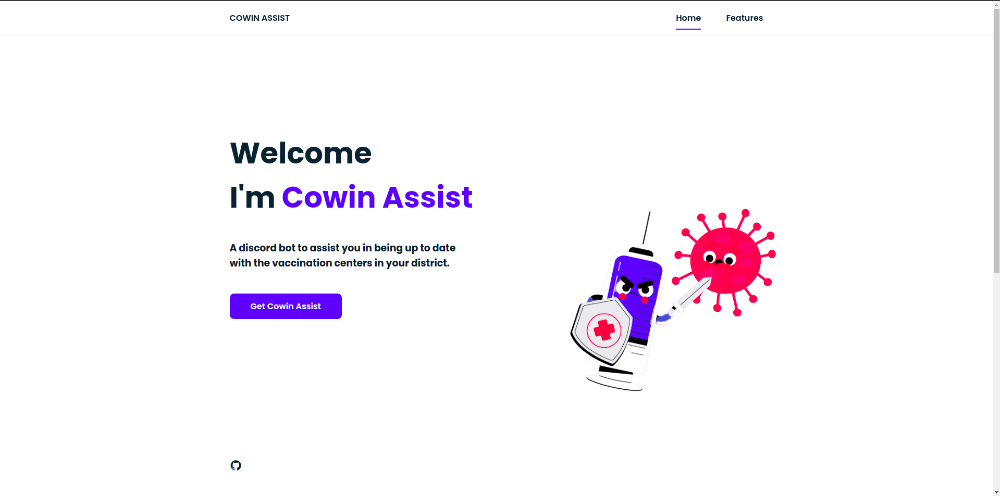
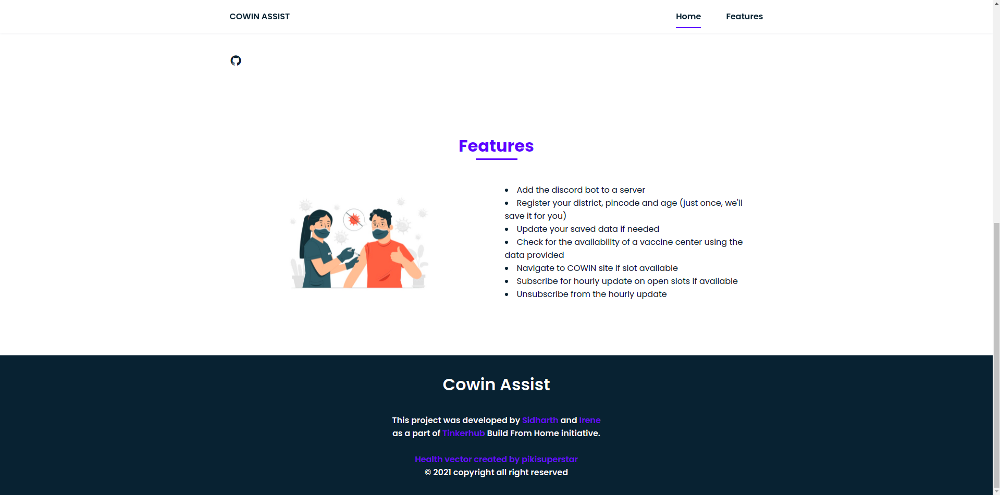

### Table of contents

<!--ts-->

-   [What is Cowin Assist?](#what-is-cowin-assist)
-   [Features](#features)
-   [Workflow](#workflow)
-   [How to add the bot to your server?](#how-to-add-the-bot-to-your-server)
-   [Demo](#demo)
    -   [BOT](#bot)
    -   [Web Interface](#web-interface)
-   [Contributing](#contributing)
    -   [Requirements](#requirements)
-   [License](#license)
<!--te-->

### What is Cowin Assist?

Cowin Assist is a discord chat-bot that lets the user track the availability of covid vaccination centres in India via the [CoWin API](https://apisetu.gov.in/public/api/cowin#/). It has a bunch of commands through which the user can set/update their desired filters to receive up to date information regarding the vaccine centres.

### Features

The Cowin Assist lets you,

-   Add the discord bot to a server,
-   Register your district and age (just once, we'll save it for you),
-   Update your saved data if needed,
-   Check for the availability of a vaccine centre using the data provided,
-   Navigate to COWIN site if slot available,
-   Subscribe for an hourly update on open slots if available,

For detailed information regarding the slash commands check [this](commands/README.md) out.

### Workflow

For detailed understanding of the working of the project refer the [flowchart](images/flowchart.jpg) that we have prepared.

### How to add the bot to your server?

1. Ensure that you have the latest version of the discord client
2. Visit the **Cowin Assist Bot's** [website](https://cowin-discord-bot-1.uknowwhoim.repl.co/) and click on the **Add to server** button.
3. Then login or register with your discord server.
4. After logging in, select the server from the list where you wish to display the Bot.
5. Provide authorization for the Bot to regulate and control your discord server.
6. Check the **Add the bot to a server** and press the **Authorize** option.

### Demo

#### Bot

    
    
    
    

#### Web Interface

    
    

### Contributing

You may notice sever `jshint ignore` comments in the code. It's because JSHint has not yet released support for optional chaining(`.?`). The feature is in the works for [v2.13](https://github.com/jshint/jshint/pull/3486). This is a temporary fix until they release `v2.13`

#### Requirements

-   Node.js - 14.17.0
-   Discord.js - 12.5.3
-   MongoDB

### License

This project is licensed under the permissive open-source [MIT license](LICENSE).
